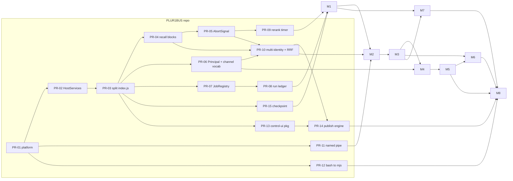

# Milestones — PLUR1BUS Harness (Variant B)

**Status:** Phase 0 deliverable, awaiting owner approval · **Date:** 2026-09-22 · **Owner:** Christian (Cyb3rb1ade)
**Re-cut of** `docs/phase0/auftrag-original-2026-09-21.md` §12 (M0–M8) for **Variant B** per `docs/phase0/brief.md` D1–D11 and ADR-001 (K4 tripped, K3 red on Windows arm64). Every §12 acceptance criterion reappears below, re-cut; the 16 operational criteria of `docs/learnings-hermes-openclaw.md` §3 are mapped as **L1–L16**; ADR-001's targets T1–T7, ADR-009's A1–A8 and ADR-010's B1–B10 are milestone exit criteria. Engine work is PRs in the **PLUR1BUS repo** (`docs/engine-extraction.md` §c, PR-01…PR-15; ADR-002's P0–P10 is the same plan at coarser grain).

---

## 1. Principles

| # | Principle | Source |
|---|---|---|
| P1 | **CLI before GUI.** Every capability is usable from `plur1bus-harness` before it gets a screen. M1/M2 ship no UI; M3 is the first UI milestone. | brief §1 D1; ADR-004 (CLI and UI are peer clients of one API) |
| P2 | **Two repos, interleaved.** Engine PRs land in `Cyb3rb1ade/PLUR1BUS`; harness milestones consume the engine by pinned version. During M1 the harness consumes CI prereleases `0.x-<sha>`; from M2 semver ranges. | D3; ADR-002 §"Two repos vs monorepo"; `engine-extraction.md` §e.4 |
| P3 | **Each milestone ends with: demo guide + test report + open points + owner approval.** No milestone starts before the previous is approved; §12's closing rule, kept verbatim. | original §12 |
| P4 | **Small, topical commits** (Conventional Commits), CHANGELOG entry per milestone, no secrets or real user data anywhere. | original §0; brief §3 |
| P5 | **Subagent-driven implementation, model matched to task:** Haiku for mechanical extraction/port and fixture generation, Sonnet for code reading, adapters, matrices and tests, Opus for API/contract design, security review and ADR amendments. | D11 |
| P6 | **One independent reviewer per milestone** — a subagent that did not write the code, running the milestone's own acceptance list plus the DoD in §6, reporting to the owner. Engine PRs additionally carry the behaviour-neutrality gate. | D11; `engine-extraction.md` §c |
| P7 | **No product code on a criterion without a test.** Acceptance criteria below are written as executable tests (§5); a milestone is not done because a demo worked once. | original §11 |

**Effort convention.** All estimates are **agent-days (ad)**: one focused subagent working day including its own unit and contract tests and the doc page for that surface, with **one human owner** reviewing. Ranges are low = everything verified in Phase 0 holds; high = one named risk in §4 materialises. **Excluded:** owner review latency, upstream PLUR1BUS review latency (P2), and spikes already itemised in the ADRs (ADR-011 §"Verification spike list" ≈ 10 ad; ADR-004 framework spike 2 ad; ADR-008 A2A-0.3 spike 0.5 ad) — those are added per milestone where they block.

---

## 2. Milestones

**M1 is split in two, per owner decision 2026-09-22 (B15, "yes"):** M1a ends in an **owner gate** before M1b starts, so a mis-drawn extraction boundary is caught after three PRs rather than after ten.

| M | Title | Engine PRs | Effort (ad) | Blocking questions |
|---|---|---|---|---|
| M0 | Phase 0 — analysis, ADR-001…011, matrices | — | done | Q1 (answered: B) |
| M1a ✅ **done 2026-09-23** — merged as [openclaw-plur1bus-memory#184](https://github.com/Cyb3rb1ade/openclaw-plur1bus-memory/pull/184) (`main` @ `01861add`); suite 5225/5222/0/3; contract 1.2.0; owner gate open (see `docs/superpowers/sdd-archive-m1a/whole-branch-review.md` §Owner-gate notes) | Engine extraction: platform, HostServices, index.js split · `Host` interface · golden-prefix corpus — **owner gate** | PR-01…PR-03 | **~14–20** (part of the 45–70 below) | ADR-002 Q1/Q2 (both answered 2026-09-22 — package names confirmed, recall budget "40/60" interpreted as 400/600 ms pending confirmation), **before PR-01** |
| M1b | Recall/capture/jobs · core daemon · IPC · session store · in-process embedding · dreaming scheduler · CLI | PR-04…PR-09, PR-15 | **~31–50** (part of the 45–70 below) | Q8 (answered: keep `SOUL.md`, D14), Q9 (answered), Q10 (answered: four files, D15), Q11 (answered: measure first); ADR-009 Q1–Q7; ADR-010 Q6/Q7 |
| M2 | Models, providers, auth, caching, budgets | PR-10, PR-11 | **30–46** | Q3; ADR-006 Q1–Q5; ADR-005 Q1–Q5; ADR-010 Q1–Q5 |
| M3 | Harness API · users/roles · agents · web UI skeleton | PR-06 follow-up (`subject`/v2) | **32–48** | Q5; ADR-004 Q1–Q5; ADR-007 Q1–Q6 |
| M4 | Channels: Telegram, Discord, Matrix, Buzz | PR-06 channel vocabulary (**M4 blocker**) | **22–34** | Q4; ADR-003 Q1–Q3 |
| M5 | Collaboration: projects, consult/delegate, guardrails, trace | — | **18–28** | ADR-003 Q4/Q5 |
| M6 | MCP/ACP/A2A · external coding agents · skills · plugins | — | **30–44** | Q7; ADR-008 Q1–Q6; ADR-011 Q1–Q6 |
| M7 | Importers: OpenClaw, Hermes | PR-10 (identity migration path) | **14–22** | ADR-007 Q4 |
| M8 | Platform hardening · installers · services · release v0.1.0 | PR-12, PR-13, PR-14 | **20–32** | Q2; ADR-001 Q3/Q5 |
| | **Total** | | **211–324** | |

### M0 — Phase 0 (done, awaiting approval)

Delivered: `brief.md`, `host-contract.md`, `engine-extraction.md`, `learnings-hermes-openclaw.md`, `provider-matrix.md`, `platform-matrix.md`, `import.md`, ADR-001…011, `assumptions.md`, this file. **Exit:** owner approves B (Q1), the ADR set moves Proposed → Accepted, and the blocking questions for M1 are answered. **Effort:** spent.

### M1 — Engine extraction, core daemon, CLI skeleton (split into M1a + M1b, owner decision 2026-09-22, B15)

**M1a/M1b boundary.** Per the owner's "yes" to B15, M1 is split at the point where a mis-drawn extraction boundary would otherwise surface three PRs later: **M1a** = PR-01 (`lib/platform.js`) → PR-02 (`HostServices` injection) → PR-03 (split `index.js` into engine + adapter) plus the frozen `Host`/`Engine`/`Principal`/`TurnOrigin` `.d.ts` and the golden-prefix corpus, gated by an **owner review** before M1b starts. **M1b** = everything else below (PR-04…PR-09, PR-15, the core daemon, IPC, session store, in-process embedding, dreaming scheduler, CLI skeleton, benchmarks). The scope, acceptance and exit criteria below are written for the combined M1; the per-PR grouping into M1a/M1b is given in the scope bullets and the table row above.

**Goal.** PLUR1BUS is a host-neutral engine; the harness is its native host; a fact said in session 1 is recalled in session 2 from the CLI, with rerank, and a killed engine never blocks a turn.

**Scope**
- **Engine (PLUR1BUS repo):** PR-01 `lib/platform.js` (`securePath`/`ipcAddress`/`isUnsafeLink`/`canonicalIdentityPath`, `HOME`→`homedir()`) · PR-02 `HostServices` injection (341 `api.logger` sites) · PR-03 split `index.js` into engine + `adapter/openclaw` · PR-04 `recall()` → `ContextBlock[]` with the six named blocks and the 17 000-char budget preserved · PR-05 **mandatory `AbortSignal`** through recall (fixes `memory-host-runtime.js:170-171`) · PR-06 typed `Principal`/`TurnOrigin` + open channel vocabulary · PR-07 `JobRegistry` for all 18 job names · PR-08 **run ledger written before any early return** (behaviour-changing, owner decision) · PR-09 single rerank timeout owner · PR-15 `checkpoint()`. `engine-extraction.md` §c.
- **Core daemon:** exactly one resident process per installation, multi-tenant by `agentId`; JSON-RPC 2.0 over UDS / named pipe with `timingSafeEqual` token, `0o600`/pipe-ACL; submit/event turn loop; `node:sqlite`+FTS5 session store (V1/V2); supervisor with backoff and health. ADR-001 §"Process model"; ADR-010 L2.
- **In-process embedding + reranking**, one load per model, warm-up in background, in-process owner replacing the loopback claim listener on the harness path (ADR-001 conflict C1). ADR-006 Option A; D9.
- **CLI `plur1bus-harness`:** `setup`, `doctor`, `agent`, `memory`, `dreams` (+ stubs for `user`, `model`, `login`, `channel`, `project`, `import`, `service`, `update`, `uninstall`). Bundled, lazy `import()` for every native/provider dependency, `NODE_COMPILE_CACHE`. ADR-004 §"Harness API" CLI row; `platform-matrix.md` §5.
- **Recall/capture/tools/commands:** 5 tools, the `/state|/memory|/forget|/correct|/mf|/share` command set, deny-by-classification tables kept engine-side; harness budgets soft 400 ms / hard 600 ms (re-answered 2026-09-22, "40/60" — interpretation pending confirmation; was 1 200 ms hard), reactivation race 50 ms unchanged. ADR-002 §"Time budgets"; Q8 keeps `SOUL.md` unchanged (owner decision D14, 2026-09-22 — reverses the earlier planned rename to `persona.md`; ADR-003).
- **Dreaming scheduler** in the core: three phases with own cron+timezone+enable+stagger, `dream_run`/`dream_schedule`/`dream_candidate` tables, all guards (breaker, dedupe, staleness, min corpus, utility gate, bounded prior-entry loss, model-emits-operations, fresh context, budget, concurrency 3), idempotency key over transcript digest, diary, `dreams status|run|log|diary`, doctor check. **Never a host cron.** ADR-009.
- **Fail-soft + degraded mode** as a first-class state visible in CLI, API and (later) UI. ADR-002 §"Degraded mode".
- **Benchmarks from day one:** B1–B10 harness with mock provider; B1/B6/B9 as build gates (ADR-010 Q7 may relax to advisory until M3).

**Acceptance** (§12 M1 re-cut, plus operational criteria)
1. Fact stated in session 1 is correctly recalled in session 2 **with rerank** (§12 M1).
2. `/forget` is archive-first; tombstone written; source row recoverable (§12 M1).
3. **Core kill blocks no turn:** 1 000-turn soak with the engine killed at random — 0 blocked turns, degraded state visible in CLI and `doctor` (§12 M1; T5).
4. No second memory loop: the OpenClaw memory slot and any host dreaming are not reachable on the harness path; one engine owns `rem-dream`/`consolidate-daily`/`classify-recent` (§12 M1 re-cut of "Hermes memory loop off"; D4).
5. **T7:** exactly one resident core process; no second LanceDB/ONNX handle.
6. **A1–A8** (ADR-009) pass with a virtual clock for A1/A8 — these carry **L4** (dedupe + circuit breaker + spend cap, A3), **L5** (never promote `recalls = 0`, A5) and **L6** (importance-triggered with cron only as a floor, subject to ADR-009 Q2).
7. **L15:** every job run, including every skip, has a ledger row written before the body. **L16:** no phase is disabled by a side effect of another switch; the probe may degrade, never disable.
8. **L1/L2/L14:** compaction summariser bound proven by property test over sessions 1×–10× the window; a single tool result is truncated-with-pointer at the boundary; compaction thresholds computed from measured token counts.
9. **L3:** a clipped or dropped injection block emits a typed event and a deferral record — no silent truncation anywhere (engine PR-04 + ADR-002).
10. **L12:** capability detection follows memory → 24 h disk → permissive default + background refresh; **B9/T3** assert 0 socket and 0 spawn syscalls during prompt assembly.
11. **B1 < 100 ms p95** for `--help` on macOS arm64 and Windows x64; **B8 < 3 s** daemon ready without local models, **< 15 s** with the default model warmed in background.
12. Every engine PR green under both adapters: full PLUR1BUS suite (502 files / 109 502 lines) + the per-PR gate, incl. the golden-prefix byte-identity corpus (PR-04).

**Blocking questions:** Q8 (persona file name), Q9 (default embedding model — needed for warm-up and store creation), Q10 (promotion target `KNOWLEDGE.md`), Q11 (cost cap); ADR-002 Q1 (package names) and Q2 (400/1 200 budget) **before PR-01**; ADR-009 Q1–Q7; ADR-010 Q6 (pre-warm) and Q7 (gate strictness). ADR-009 action item 1 (does anything read REM trends?) is **blocking for giving REM a schedule**.

**Effort 45–70 ad.** Engine PR-01…09+15 28–42 (PR-02/03/06/10 are L, 4 × L in the plan), core daemon + IPC + session store 8–12, scheduler + guards + ledger 6–10, CLI skeleton + bundling 3–6. High end assumes boundary rework in PR-03 (risk R1 §4).

**Exit:** demo guide (two-session recall, kill-the-engine, `dreams run deep`), test report incl. B1–B10 baseline, CI matrix skeleton green on five targets with the three named degradations, open-points list, CHANGELOG, `docs/embedding-identity.md`.

**Status — M1b-2a-H1 (harness foundation) — done 2026-09-25:** acceptance 1 (two-session recall via the CLI with a core SIGKILL and journal replay, `tests/system/two-session-recall.test.ts`; rerank asserted in the nightly real-model run, `.github/workflows/nightly.yml`), spec criteria 6, 7, 8 (B1 `--help` p95 < 100 ms and B11 `core.status` p95 < 5 ms as gates in `pnpm bench`, B8 advisory; B9 in `packages/core/test/b9-no-syscalls.test.ts`), 10 (docs half); H2 carries 2, 3, 4, 5, 9, 11, 12.

### M2 — Models, providers, auth, caching, budgets

**Goal.** Three chat wire formats, remote embedding/rerank, a data-driven auth engine that ships no `prohibited` profile, and a cache-stable prompt layout that is CI-enforced.

**Scope**
- **Chat:** `chat_completions`, `codex_responses`, `anthropic_messages` behind generic OpenAI-/Anthropic-compatible templates; streaming, tool calls, typed error taxonomy. ADR-001 Option B; original §6.1.
- **Embedding/rerank remote adapters:** OpenAI, Google, Cohere, Jina, Voyage, OpenRouter pass-through, Ollama, TEI, vLLM, llama.cpp, oMLX; the five unverified rerank response shapes closed by live smoke test before the mapping table freezes (ADR-006 action 3, §"Rerankers" table).
- **Auth engine:** four kinds (API key, OAuth PKCE loopback, device code, ADC), **declarative profiles as data**, headless ladder (device code → loopback with `ssh -L` hint → `--paste-callback`), one `canOpenGraphicalBrowser()`/`isRemoteSession()` pair, proactive refresh with a single refresh owner, credential pools with ambiguous-vs-confirmed cooldown classification, one cooldown authority shared with cron. ADR-005.
- **Secret store** on `@napi-rs/keyring` (prebuilds confirmed on all six targets) with encrypted-file fallback and short-lived leases to the engine; keytar rejected. ADR-005 §"Secret storage"; `platform-matrix.md` §2.
- **Policy catalogue:** every profile carries `policy_status`/`policy_source`/`policy_checked`. **Anthropic ships three routes (D12, 2026-09-22):** **Claude Code / Agent SDK** as the default, `allowed` (spawns the unmodified binary/SDK under the user's own login, never a harness-native Claude.ai login); **setup-token** (OpenClaw-style), new, `restricted`, opt-in with a visible risk notice, narrowing §6.3's no-client-imitation rule for tokens the user obtained themselves; and **API key**, `allowed`, unchanged. A harness-native Anthropic OAuth stays absent. **OpenAI and xAI OAuth ship `restricted`, opt-in with a risk notice** (moved from "not shipped" by D12, imported from OpenClaw as disabled-until-opted-in). **Google subscription OAuth stays `prohibited` and unshipped**, rendered as a visible **disabled** entry with the reason and the ACP alternative. `provider-matrix.md` §4; ADR-005 §"Conflicts", "Amendment D12".
- **Prompt-cache-aware layout:** four zones (tools → system → frozen memory snapshot → conversation) with the six engine blocks delivered **after** the last breakpoint; R1–R8 incl. per-model minimum table, per-(agent,model) prefixes, sticky `session_id` on OpenRouter, TTL awareness, telemetry. ADR-010 §1; D7.
- **Budgets:** per agent / project / user, per-zone allocation, typed retry budgets, subagent return cap ~2 000 tokens. ADR-010 §4.
- **Engine PRs:** PR-10 multi-identity recall (per-route dimension, one query vector per identity, RRF fusion, share re-embeds into the **target** identity, identity in the cache key) — behaviour-changing, owner decision; PR-11 Windows named-pipe embedding IPC.
- Compatibility probe, calibration run, re-embedding migration driven from the CLI (`plan/apply/resume/rollback/status/switch`), model preparation with SHA-256-pinned artefacts and an offline mirror bundle. ADR-006 §"Embedding identity", actions 6/7/10.

**Acceptance** (§12 M2 re-cut)
1. **Device-code login headless over SSH** succeeds for a profile that documents one; where none exists, the loopback+`ssh -L` and paste-callback paths succeed instead and the CLI says which was used (§12 M2, re-cut because no frontier vendor documents a usable device code — ADR-005). For the **Anthropic via Claude Code / Agent SDK** profile there is no harness-managed login step to test headless at all: the user runs the vendor's own `claude setup-token` (or interactive `claude login`) themselves over their own SSH session, and the harness backend only then spawns the already-authenticated binary/SDK — the CLI surfaces this as "run `claude setup-token`, then attach" rather than as a harness-driven flow.
2. Refresh survives a daemon restart; rotating refresh tokens are single-use with exactly one refresh owner (§12 M2).
3. One turn **with a tool call** over each of the three chat wire formats against recorded fixtures (§12 M2).
4. Embedding over one remote endpoint and two local servers; rerank locally (BGE or Qwen3) and over one remote adapter (§12 M2).
5. **Two agents with different embedding identities in parallel; `/share` into a pool re-embeds in the target identity** (§12 M2; PR-10 gate).
6. Model change by migration with rollback; **compatibility probe refuses a wrong model** and says why (§12 M2).
7. No profile with `policy_status: prohibited` is loadable — asserted in CI (ADR-005 action 3).
8. Secret redaction test over logs, API responses, exports, backups and import reports finds no known test token (ADR-005 action 8).
9. **L7/L9:** memory is live within a session without breaking the cache (frozen snapshot in zone 3, recall as `tool_result` in the tail); a model switch warns and confirms, per-model prefixes preserved. **B5 ≥ 0.90** cache-read share from turn 3, **B6** zone hashes byte-identical across two renders and two process starts.
10. **L8:** budget checked before every model call; a breach refuses rather than truncates silently.
11. PR-10 single-identity configuration produces byte-identical recall order on the frozen corpus (RRF over one list = original order).

**Blocking questions:** Q3 (confirm ADR-005's replacement of the opt-in default), ADR-006 Q1 (default embedding model) and Q2 (default reranker) and Q4 (multi-identity in v0.1 — if deferred, PR-10 moves to post-v0.1 and §12 M2 criterion 5 moves with it), ADR-005 Q3 (encrypted-file key), Q5 (per-user credentials), ADR-010 Q1–Q3.

**Effort 30–46 ad.** Three wire formats 7–10, embedding/rerank adapters + live smoke 5–8, auth engine + pools + secret store 8–12, prompt builder + zone tests + budgets 5–8, PR-10 5–8 (L, ranking-affecting).

**Exit:** demo guide (login headless, three wire formats, migrate a store), test report incl. B5/B6/B7, frozen rerank field-mapping table, `docs/provider-matrix.md` updated with the cache-capability columns, first dated policy re-check scheduled (2026-12-21).

### M3 — Harness API, users/roles, agent management, web UI skeleton

**Goal.** One deny-by-default authorization chokepoint, and the first screens: Memory (incl. Dreams) and Models, in PLUR1BUS optics.

**Scope**
- **Harness API** as the only listening TCP surface, loopback by default: `/api/v1/**` REST, `/rpc` JSON-RPC, `/events` SSE, `/ws` for PTY/approvals; session cookie + CSRF one-time token; personal API tokens (prefix+hash, scopes narrow only); Argon2id, optional OIDC, TOTP/WebAuthn; CSP with per-response nonce; rate limits per identity and route class; audit over the §11 event list. ADR-004; ADR-007 §"Authentication".
- **RBAC:** capability enum + five role presets (Owner/Admin/Operator/Member/Viewer) with "simple mode", object rights per agent (`use`/`manage`) and project (`member`/`lead`), one `authorize(principal, action, object)`. ADR-007 §"Roles", §"Enforcement".
- **Identity:** `user:v2:sha256(harnessUserId)` derived engine-side from a host-supplied `subject`; regex widened to `^user:v(1|2):`; union recall over v2 ∪ linked v1 principals; pairing store (pending ephemeral / approved durable / declined / rate limits); metadata-only back-fill, never via `/share`. ADR-007 §"Identity linking"; engine follow-up to PR-06.
- **Agent management:** create saga engine-first with per-step compensation and idempotency key, pause, archive, archive-first delete with identity-bound confirmation, export/import bundle **without secrets**; `AgentScope` on `AsyncLocalStorage` with a fail-closed test for a worker started without scope; the per-agent vs process-global table published in the UI. ADR-003 §"Lifecycle", §"Isolation".
- **Web UI skeleton** (framework decided by the 2-day spike): Memory area first (health, cards, search-with-explain, reviews, conflicts, migration, compact) with **Dreams** sub-area, then Models, then Agents/Users/My area/Doctor/Settings. Theme from the `--oc-*` bridge with the verbatim MIT attribution header, dark default + light per OS, `data-density` comfortable, **settings search** over label/key/help/value, routed pages instead of one long page. ADR-004 §"Theme", §"Pages".
- **First-run wizard:** owner bootstrap one-time token → embedding/reranker choice **with licence gate** (NC only by explicit owner confirmation, audit-logged; non-interactive falls back to E5-small, never a silent acceptance) → first provider login → first agent → optional import. ADR-004 §"First-run wizard"; ADR-006 §"Installer default".

**Acceptance** (§12 M3 re-cut)
1. Wizard including the **licence query** completes end to end, and the confirmation records who/when/which licence/which model+revision (§12 M3).
2. Two agents created, operated and deleted through the UI; delete is archive-first with export offer and identity-bound confirmation (§12 M3).
3. A **Member sees only shared agents and only their own `user`-scope memories** (§12 M3).
4. **Break-glass produces an audit entry**, requires a reason, is time-boxed, and notifies the affected user (§12 M3; ADR-007).
5. Deny-by-default suite: every endpoint rejects unauthenticated; every endpoint rejects a Viewer write; an API token cannot exceed its user's role (§11).
6. A linked user's recall returns the union of v2 and linked v1 rows without any vector being rewritten.
7. a11y gate: axe-core WCAG 2.1 AA clean on shipped pages, full keyboard traversal, 4.5:1 contrast on both themes.
8. **L16 (UI half):** every provisioning outcome is machine-readable and surfaced by `doctor`.

**Blocking questions:** Q5 (five roles vs slim), ADR-004 Q1 (framework, after the spike), Q2 (density default), Q3 (built-in TLS in v0.1), Q5 (logo package scope), ADR-007 Q2–Q6.

**Effort 32–48 ad.** API + authN/RBAC/audit 10–14, identity linking + pairing + engine follow-up 5–8, agent lifecycle saga + AgentScope 5–7, UI framework spike 2, UI shell + theme + settings search 6–10, Memory/Dreams/Models pages 4–7.

**Exit:** demo guide (wizard, two agents, Member isolation, break-glass), test report, `docs/api-surface.md` frozen, `docs/ui/reference/*.png` pipeline with visual diff, theme file with attribution header.

### M4 — Channels: Telegram, Discord, Matrix, Buzz

**Scope.** Four adapters behind one interface — grammY, discord.js, matrix-js-sdk + `@matrix-org/matrix-sdk-crypto-wasm` 18.9.0 (**WASM, not the NAPI package** — `platform-matrix.md` §3), nostr-tools for Buzz. Chat commands in every channel; cron/feature delivery only to **validated** targets; identity linking via pairing codes (8 chars, unambiguous alphabet, 1 h, max 3 pending, `0600`, pending never exported); behaviour profiles `direct`/`group` with the four-level monotonic merge (deny-union, scope-intersection) and the shipped group defaults (`on-mention`, `provenance-only`, no `captureOtherSpeakers`). ADR-003 §"Behaviour profiles"; ADR-007 §"Pairing flow". **Engine blocker:** PR-06's host-declared `SUPPORTED_ROUTE_PROVIDERS` and trusted-command list — without it Matrix and Buzz users get no principal and their commands are refused (ADR-007 Finding 1); it is the **first** of the principal PRs.

**Acceptance** (§12 M4 re-cut)
1. **The same agent with the same persona on all four channels** (§12 M4).
2. **A linked user is remembered as the same principal on two channels; an unlinked one is not** (§12 M4; fail-closed per ADR-007).
3. **A feature cron delivers to a validated target** and refuses an unvalidated one (§12 M4; ADR-009 §"Delivery").
4. Behaviour-merge matrix green: 4 layers × {direct,dm,group,channel} × 4 channel kinds, with the deny-union and scope-intersection invariants (ADR-003 action 2).
5. Matrix E2EE device verification works on all five targets from one WASM artefact.
6. An inbound event matching no route is dropped and logged, never broadcast (deny by default).

**Blocking questions:** Q4 — confirm "one agent, many bot connections" for M4 and mention routing no earlier than M6; ADR-003 Q2 (fifth per-chat layer), Q3 (group capture default).

**Effort 22–34 ad.** Telegram 3–4, Discord 3–5, Matrix incl. E2EE and verification 7–11, Buzz/Nostr 4–6, identity linking + commands + delivery 5–8.

**Exit:** demo guide (one agent on four channels, pairing, cron delivery), test report incl. channel E2E against fakes, per-channel setup docs.

### M5 — Collaboration: projects, consult/delegate, guardrails, trace

**Scope.** Project = one PLUR1BUS workspace + per-agent git worktree + task board + note board + workspace pool + roles lead/worker/reviewer + budget. Six tools (`consult_agent`, `delegate_task`, `post_to_project`, `read_project_board`, `request_review`, `handoff`) over one uniform target surface. Typed delegation contract (objective, scope, forbidden actions, output schema, citation requirement, ≤2 k token cap, model tier, deadline). Guardrails enforced in code: depth 1, cycle/self-call blocked, 3 calls per turn / 2 per pair, 25 turns / 5 min, budget checked before every call, user abort propagates, partial success representable. Peer output enters as `tool_result` with a provenance envelope — never as system or assistant text. Optional mirroring into Buzz/Matrix. ADR-003 §"Collaboration".

**Acceptance** (§12 M5 re-cut)
1. **Agent A solves a task with advice from agent B** (§12 M5).
2. **A cycle attempt is blocked** (§12 M5).
3. **The trace is complete** — who asked whom, cost, result, replayable session per delegation (§12 M5; **L13**).
4. **No unwanted leak of private memories:** the consulted agent's `agent-private` and any `user`-scope content never reaches the caller's store, the workspace pool or a remote agent (§12 M5).
5. Budget refusal and timeout→partial-result tested (ADR-003 action 7).
6. **L10:** success is decided by external verifiers (typecheck/test/lint gates), not by the delegate's self-report.
7. **L8 (project half):** per-project budget enforced before every fan-out.
8. Fan-out eval: ≥20 cases, single agent vs peer collaboration at **equal token budget**, results recorded here before any fan-out default is enabled (ADR-003 action 8).

**Blocking questions:** ADR-003 Q4 (own store for external agents), Q5 (depth 1 vs two-level chain).

**Effort 18–28 ad.** Projects + board + worktrees 6–9, six tools + contract + provenance 5–8, guardrails + budget gate 3–5, trace UI + mirroring 3–5, fan-out eval 1–2.

**Exit:** demo guide, test report incl. guardrail suite and the fan-out eval numbers, `docs/architecture.md` isolation table updated.

### M6 — MCP / ACP / A2A, external coding agents, skills, plugins

**Scope.** Official TS SDKs, pinned: `@modelcontextprotocol/sdk ^1.30` (spec 2026-07-28), `@agentclientprotocol/sdk 1.5.0` (**schema v1 only**, v2 alpha excluded), `@a2a-js/sdk 1.2.0` (spec 1.0.0, **JSON-RPC+SSE as the single declared interface**, server off by default, push notifications off, card JWS/JCS-signed and content-free). **Never** MCP Sampling, Roots, Logging or Dynamic Client Registration. MCP client with per-agent allowlist, per-tool approval, lazy connect and a **visible per-server token cost** (13.7k–18k tokens/server); MCP server with deny-by-default exposure behind `authorize()`. ACP agent side (`plur1bus-harness acp`, stdout is JSON-RPC only) and client side. **External coding agents** as three tiers: Tier 1 ACP (M6 set: Claude Code, Codex, Goose gated; Gemini CLI (now Antigravity CLI `agy`, D40) best-effort), Tier 2 headless JSON (`claude -p --output-format stream-json`, `codex exec --json`), Tier 3 PTY opt-in and labelled unsupported. Discovery probes **existence only** of credential paths — never reads, copies, parses, logs or forwards their contents. Skills (install, preview before activation, versions, proposal queue) and plugins (source/version pinning, permission display, per-agent disable) in the UI. ADR-008; ADR-011; original §8.

**Acceptance** (§12 M6 re-cut)
1. **Add an MCP server through the UI and use it** (§12 M6).
2. **PLUR1BUS tools reachable from a foreign MCP host**, ACL-bound (read-only memory tools in v0.1 unless ADR-008 Q4 says otherwise) (§12 M6).
3. **Drive the harness from Zed** over ACP (§12 M6).
4. **An external ACP agent as a team member:** attach each of the four M6 CLIs by discovery, run one `delegate_task` per CLI against a fixture repo in a worktree, a permission request reached the approval policy, a write outside the worktree was refused, the transcript replays (§12 M6; ADR-011).
5. **A foreign A2A client finds the Agent Card, sends a task and receives a streamed result**; events are delivered in generation order (§12 M6).
6. **A harness agent consults a remote A2A agent** (§12 M6).
7. Negative-capability test: a fixture MCP server offering Sampling/Roots/Logging — we negotiate none and still work.
8. Cross-protocol test: **no memory content** in any generated Agent Card, MCP tool schema or ACP capability payload.
9. Credential-probe audit: a test plus a lint rule prove no code path reads a credential file's contents (ADR-011 spike 11).
10. Worktree containment red-team green: symlink, `..`, absolute path, `$HOME` write, `git config core.hooksPath`.
11. **L11:** mined skills are inactive until reviewed; self-improvement never overwrites human-authored artifacts (`write_approval`-equivalent on by default for self-knowledge).

**Blocking questions:** Q7 (minimum CLI set), ADR-008 Q1 (drop A2A 0.3), Q2 (push notifications off), Q3 (MCP default exposure), Q4 (memory tools read-only), Q5 (ACP v2), ADR-011 Q1–Q6. Prerequisite spikes: ADR-008 action 10 (0.5 d) and action 11 (Windows stdio audit), ADR-011 spikes 1–11 (≈10 ad, counted below).

**Effort 30–44 ad.** MCP client+server 6–9, ACP both directions 5–7, A2A server+client+TCK 6–9, external-agent tiers + descriptors + nightly matrix 8–12, skills + plugins UI 4–6, spikes 1–2 (rest absorbed).

**Exit:** demo guide (Zed, foreign A2A client, four CLIs), test report incl. TCK/ITK results, nightly per-CLI integration matrix live with the auto-degrade rule.

### M7 — Importers: OpenClaw and Hermes

**Scope.** `plur1bus-harness import <openclaw|hermes>` plus a UI wizard; dry-run default, copy-never-move, idempotent and resumable, snapshot before, rollback, source-version detection, conflict strategy, report (JSON + readable) **without content or secrets**; secrets opt-in and allowlist-based, straight into the secret store, never in the report. OpenClaw: agents, persona (`SOUL.md` accepted on import, `SOUL.md` written — kept unchanged by owner decision D14, 2026-09-22), curated files (`memory/YYYY-MM-DD.md` → `DailyNote_*`, `MEMORY.md` → `memories.md`, `KNOWLEDGE.md` → `knowledgepool.md`, `DREAMS.md` → `dreaming.md`, per owner decision D15, 2026-09-22), skills, cron, channel config and allowlists, and the **PLUR1BUS stores in full** — take-over without re-embedding when the embedding identity is preserved, otherwise the guided re-embedding migration. Hermes: profiles → agents, `SOUL.md`, `MEMORY.md`/`USER.md` → cards with provenance `imported` (`MEMORY.md` → `memories.md`, D15), skills, cron, platform config, **approved pairing lists imported / pending codes excluded**. original §4.2; `docs/import.md`.

**Acceptance** (§12 M7 re-cut, = `import.md` §6.3)
1. Dry-run against the OpenClaw fixture matches the report schema with **zero writes** to source or target.
2. Apply on the matching-identity store: take-over **without re-embedding**, old memories are recalled, and the source directory is **byte-identical** before and after.
3. Hermes fixture: soul, skills and cron imported; `MEMORY.md`/`USER.md` entries land as cards with provenance.
4. **A second run is idempotent** — zero new writes, every entity reported `matched-existing`.
5. The mismatched-identity store is routed into re-embedding migration, **never silently mixed** into another vector space.
6. Rollback restores the pre-apply state exactly.
7. Fixtures are hand-authored and synthetic; a grep for known fixture tokens finds nothing in any report.

**Blocking questions:** ADR-007 Q4 (unlink semantics affects the v1→v2 back-fill offered during import).

**Effort 14–22 ad.** Fixture generation (both sources, two embedding identities) 3–5, OpenClaw importer 5–8, Hermes importer 4–6, wizard + report + rollback 2–3.

**Exit:** demo guide, test report against both fixtures, import guide in the docs.

### M8 — Platform hardening and release v0.1.0

**Host adapters (D28, `docs/host-adapters.md`), scheduled after M3 and ordered by demand:** the client kits `@plur1bus/memory-client` (TS) and `plur1bus-memory-client` (Python) and the memory proxy belong to M3's HTTP API; then the thin OpenClaw plugin (also NemoClaw), the Hermes `MemoryProvider`, the Open WebUI filter, and a ZeroClaw provider once its WASM question is answered. Each adapter ships with a conformance run against the ADR-016 kit.

**Scope.** `install.sh` / `install.ps1` without admin rights (user-writable Node, no system package manager), non-interactive mode with explicit flags, owner bootstrap token printed, import offered, embedding/reranker choice with licence notice; `doctor`, `update` with rollback, `uninstall`; services via launchd user agent, `systemd --user` (+ documented `loginctl enable-linger`), Windows Task Scheduler; optional Docker image (linux/amd64, linux/arm64). Engine PR-12 (four bash scripts → `.mjs`), PR-13 (extract control-UI package with a `tokens` module), PR-14 (publish `@cyb3rb1ade/plur1bus-engine`; the plugin is **not** repointed — per D28 it keeps its own separate memory or becomes a thin client of the harness, at the owner's choice). Backup/restore with dry-run, **stores first** then config, users, sessions, then the dream ledger. Documented degradations: darwin-x64 LanceDB (source build or Rosetta), Linux node-pty source build (toolchain prerequisite check), named-namespace routing POSIX-only, Linux-arm64 SEAs never built in Docker. `platform-matrix.md` §3, §6, §7; original §10.

**Acceptance** (§12 M8 re-cut)
1. **CI matrix green on all five targets** for the §10 smoke E2E (see §5.3) (§12 M8; **T6**).
2. Installers complete without admin rights on macOS arm64, Windows x64 and Linux x64/arm64; non-interactive mode reproduces the same result.
3. Service registration and survival of a reboot verified per OS; `update` rolls back cleanly; `uninstall` leaves no daemon and no service unit.
4. Backup → restore round-trip restores stores, vault, config, users, sessions and the dream ledger; dry-run reports the same plan.
5. Docs complete: README, per-platform quickstart, admin and user handbook, provider/model/channel guides, import guide, architecture, ADRs (original §11).
6. `npm audit` clean at the agreed severity, TypeScript strict, lint clean, licence attribution (MIT for OpenClaw tokens, Apache-2.0 for Buzz/A2A SDKs) present.
7. Release checklist §6.2 fully ticked; v0.1.0 tagged.

**Blocking questions:** Q2 (macOS x64 required or best-effort — decides whether we own a Rust source build in CI), ADR-001 Q3 (non-PTY degradation on win32-arm64, now largely moot since the prebuild is confirmed), Q5 (built-in TLS vs reverse proxy only).

**Effort 20–32 ad.** Installers + non-interactive 5–8, services three OSes 3–5, CI matrix hardening + smoke E2E per target 5–8, PR-12/13/14 4–7, backup/restore 2–3, docs 3–5 (written incrementally from M1 and consolidated here).

**Exit:** signed release, demo guide, full test report, known-issues list, `UPSTREAM.md`-equivalent compatibility matrix (harness × engine × OpenClaw).

---

## 3. Dependency graph

| Can run in parallel | Condition |
|---|---|
| PR-04/05, PR-06, PR-07/08, PR-11, PR-12, PR-13, PR-15 | all after PR-03; PR-10 is last of the behaviour-affecting set |
| Core daemon + CLI skeleton ‖ engine PR-04…PR-09 | harness consumes `0.x-<sha>` prereleases (P2) |
| M2 provider adapters ‖ M2 auth engine ‖ M2 prompt builder | three independent packages |
| **M7 ‖ M5 and M6** | M7 needs only M1 (stores) + M3 (wizard); it is off the critical path |
| M4 Telegram/Discord ‖ Matrix ‖ Buzz | one adapter interface, three workstreams |
| Docs, CI matrix hardening, benchmark upkeep | continuous from M1, consolidated in M8 |

**Critical path:** PR-01 → PR-02 → PR-03 → PR-04/05/06 → **M1** → PR-10 → **M2** → **M3** → **M4** → **M5** → **M6** → **M8**. M7 and the four Windows-port PRs are the only substantial off-path work.

---

## 4. Risk register (top 12)

L = likelihood, I = impact (1 low – 5 high). Owner is the accountable role, not a second person — the single human owner holds all of them; the column names who *acts*.

| # | Risk | L | I | Mitigation | Owner | Trigger (what makes it real) |
|---|---|---|---|---|---|---|
| R1 | **Engine extraction behaviour drift** — PR-03 moves the recall assembly out of a 13 496-line `index.js`; a mis-drawn boundary shows three PRs later | 3 | 5 | Golden-prefix corpus asserted byte-identical (PR-04 gate); full suite green under **both** adapters in CI; ACL reason codes frozen as an enum; boundary drawn from the measured inventory in `host-contract.md` §10. The two deliberately **behaviour-changing** PRs (PR-08 run state, PR-10 ranking) are owner decisions, not drift: PR-10 additionally gated on single-identity byte-identity plus a recorded A/B on a frozen corpus before the default flips | Engine workstream | Any PR-0x needs a test-expectation edit that is not explicitly declared behaviour-changing; or either behaviour-changing PR reaches review without a signed owner decision |
| R2 | **Windows port slips** — IPC, ACLs, PID-reuse lock, argv byte-comparison, case/separator hashing, four bash scripts | 3 | 5 | Tier-1 items are PR-01/PR-09/PR-11/PR-12, scheduled in M1/M2/M8 not M8 alone; Windows CI job from M1; `directory-capability` already self-disables and ships as a documented Tier-2 degradation | Engine workstream | Windows CI red for two consecutive weeks, or a Tier-1 item still open at M2 exit |
| R3 | **ACP/MCP/A2A spec and SDK churn** — MCP revises annually with four features on a removal clock; ACP TS SDK already churned its API; `@a2a-js/sdk` is young | 4 | 3 | Exact pins for ACP/A2A, `^1.30` for MCP; only non-deprecated surfaces used; conformance suite (a2a-tck/itk, schema validation) is a required check on every bump; ACP v2 alpha excluded | Protocols workstream | Any SDK bump fails the conformance gate, or a spec revision removes a surface we use |
| R4 | **Vendor policy changes** — a harness-native Anthropic login and Google's subscription login stay `prohibited`, but the Anthropic-via-Claude-Code/Agent-SDK backend is now `allowed` after moving three times in 2026 (April ban, May credit announcement, June pause); OpenAI ambiguous, xAI unverified | 3 | 4 | Policy is **data**: `policy_status`/`policy_source`/`policy_checked` per profile; CI refuses to load a `prohibited` profile; dated re-check every 90 days (first 2026-12-21), sooner for Anthropic on any announcement; compliant substitutes (API keys, vendor CLI over ACP) shipped for Google/OpenAI/xAI | Owner | A vendor announcement, or a re-check finding a changed status |
| R5 | **Jina CC BY-NC-4.0 licence** default would block every commercial user of an MIT repo | 2 | 3 | Default moves to Apache-2.0 Qwen3-Embedding-0.6B with MIT E5-small as keyless fallback; Jina stays behind the owner-only audited gate; non-interactive never auto-accepts | Owner (ADR-006 Q1) | Owner chooses §6.2's original Jina default, or a model relicenses |
| R6 | **Multi-identity recall complexity** — the `vectorDim` scalar is load-bearing in pools, `MemoryDB`, zero-vector placeholders, share width check and the single-`queryVector` path; thresholds (0.3 default "never filters") must be recalibrated | 3 | 4 | PR-10 is its own PR with its own acceptance test and three gates; calibration run after every identity change; fusion by rank, not score | Engine workstream | PR-10 exceeds 8 ad, or the single-identity byte-identity gate fails |
| R7 | **Dreaming cost runaway** — the #65550 shape: 94 sessions / 65 min / $4.35 / 100 % zero-confidence output | 2 | 5 | Mandatory guards: circuit breaker (3 sessions, $0.25/agent/day default), content-hash dedupe, 72 h staleness, min corpus, utility gate, concurrency 3, budget checked by the scheduler; **A3 is the regression test** | Core workstream | A3 fails, or any agent's sweep exceeds its cap in a soak |
| R8 | **UI framework spike contradicts the recommendation** or the density/search deviations drift from PLUR1BUS optics | 3 | 2 | 2-day spike builds the Models page twice, measured on bundle size, axe-core AA, keyboard traversal; deviation list frozen to four items, any further one needs a new ADR; reference-image pipeline doubles as a visual-diff gate | UI workstream | Spike shows Preact loses on a measured axis, or a review question "does it still look like PLUR1BUS?" has no diff to answer it |
| R9 | **Native binaries in CI** — darwin-x64 LanceDB has no package at all; node-pty source-builds on both Linux arches; Linux-arm64 SEA built in Docker produces a broken ELF hash table | 3 | 3 | Five-target matrix from M1 with the degradations as **named jobs**; toolchain prerequisite check in the Linux installer; SEA built only on bare-metal/VM arm64; WASM Matrix crypto everywhere | CI workstream | Any target's smoke E2E red at a milestone exit, or Q2 answered "required" without funding the source build |
| R10 | **Scope creep** — nine subsystems, four channels, three protocols, fourteen attachable CLIs | 4 | 4 | Milestone-scoped delivery with owner approval between milestones; §7 out-of-scope list is binding; support promise narrowed to four coding CLIs; MCP servers lazily connected with a visible token cost; one well-tested channel beats four half-tested ones | Owner | A milestone's scope table grows after approval, or an acceptance criterion is renegotiated mid-milestone |
| R11 | **Single-owner bandwidth** — review is the only serialisation point, and upstream PR latency sits on the critical path | 4 | 4 | Independent reviewer subagent per milestone (P6) so the owner reviews a *report*, not a diff; engine prereleases from CI so the harness never waits on a merge; **trigger to flip to a monorepo: three consecutive blocked milestones, or >1 coordinated two-repo PR per week during M1** | Owner | Either trigger fires, or a milestone's calendar time exceeds 2× its agent-day estimate |
| R12 | **Import fidelity** — a wrong take-over mixes vector spaces or mutates the source | 2 | 4 | Dry-run default, copy-never-move, byte-identity assertion on the source fixture, mismatched identity always routed to migration, idempotency as an acceptance criterion, snapshot + rollback | Importers workstream | Any apply run writes to the source, or acceptance criterion 5 fails |

---

## 5. Test plan

### 5.1 By layer

| Layer | Content | Gate |
|---|---|---|
| **Unit** | Every package; TypeScript **strict**, lint, `npm audit` in CI (original §11) | every PR |
| **Contract — chat wire formats** | `chat_completions`, `codex_responses`, `anthropic_messages` against **recorded fixtures**: streaming, tool calls, error cases | every PR from M2 |
| **Contract — embedding** | Dimension, batch behaviour, prefix/task schemes per model; bounded per-text fallback loop inside the 15 s budget | M2 |
| **Contract — rerank** | All adapters (Cohere, Voyage, Jina, TEI, vLLM, llama.cpp, oMLX, local BGE/Qwen3); field-mapping table frozen only after live smoke capture | M2 |
| **Engine contract** | Time budgets (soft 400/hard 1 200/reactivation 50 ms/embed 800/rerank 300), fail-soft, ACL reason codes as a frozen enum, `Principal`/`TurnOrigin`, compatibility probe, **no vector-space mixing**, `/share` re-embeds into the **target** identity, multi-identity recall with RRF | M1, extended M2 |
| **RBAC and privacy** | Unauthenticated denied on **every** endpoint; Viewer write denied on every endpoint; Member cannot read another user's `user` scope; API-token scopes narrow only; break-glass audited and notified | M3, re-run every milestone |
| **Retrieval benchmark** | `bench/` extended into a CI regression gate over a 20-query golden set; fails on nDCG/recall@k drop beyond tolerance; also the UI decision aid before a migration | M2 onward |
| **Channel E2E** | Against fakes for all four channels: commands, delivery, pairing, group vs 1:1 behaviour merge | M4 |
| **OAuth** | Every flow against a **mock IdP**: PKCE loopback, device code, paste-callback, refresh across restart, rotating single-use refresh, pool cooldown classification | M2 |
| **Protocol conformance** | MCP: SDK reference stdio + Streamable HTTP counterparts, negative-capability test (Sampling/Roots/Logging declined). ACP: outbound schema validation against pinned `schema/v1/schema.json`, SDK `client()` smoke, nightly Zed. A2A: `a2a-tck` + `a2a-itk`, card JCS/JWS, event ordering, `PushNotificationNotSupportedError`. Cross-protocol: **no memory content in any outbound descriptor** | M6 |
| **Importers** | Against hand-authored synthetic fixtures for both sources, incl. a two-embedding-identity store; the six acceptance tests of `import.md` §6.3 | M7 |
| **Collaboration guardrails** | Cycle attempt, depth limit, per-turn/per-pair caps, budget refusal, timeout → partial result, no private-memory leak, provenance-only ingestion | M5 |
| **Dreaming acceptance** | **A1–A8** (ADR-009) with a virtual clock; A1 (fresh install produces three phase runs and a diary in 24 h) and A3 (cost cap trips) are the two that would have caught the historical failures | M1, re-run every milestone |
| **Latency and cost benchmarks** | **B1–B10** (ADR-010) against mock providers. **Hard gates: B1** (`--help` p95 < 100 ms), **B5** (cache-read share ≥ 0.90 from turn 3), **B6** (zone hashes byte-identical), **B9** (0 socket/spawn syscalls during prompt assembly). Tracked with regression alerts: B2, B3, B4, B7, B8, B10 | M1 onward (ADR-010 Q7 may make gates advisory until M3) |
| **Engine behaviour-neutrality** | Full PLUR1BUS suite (502 files / 109 502 lines, `--test-concurrency=1`) green under both adapters, plus the per-PR gate and the golden-prefix corpus | every engine PR |
| **Containment red-team** | Worktree escape via symlink, `..`, absolute path, `$HOME` write, `git config core.hooksPath`; credential-probe audit (no code path reads a credential file's contents) | M6 |
| **a11y** | axe-core WCAG 2.1 AA, keyboard traversal, focus visibility, live regions for SSE, 4.5:1 on both themes — automated, not a manual step | M3 onward |

### 5.2 CI matrix

Runner labels from `platform-matrix.md` §1. Node ≥ 24 on every target.

| Target | Runner label | Required | Named degradation job |
|---|---|---|---|
| macOS arm64 | `macos-15` / `macos-26` | yes | — |
| macOS x64 | `macos-15-intel` | **best-effort (Q2)** | LanceDB source build (Rust) or Rosetta; SEA untested by Node CI → non-SEA distribution |
| Windows x64 | `windows-2025` | yes | — |
| Windows arm64 | `windows-11-arm` (GA for private repos, confirmed) | yes — **weakest target** | Named-namespace routing POSIX-only; stdio subprocess audit before M6 |
| Linux x64 (glibc) | `ubuntu-24.04` | yes | node-pty source build → toolchain prerequisite |
| Linux arm64 (glibc) | `ubuntu-24.04-arm` | yes | node-pty source build; **SEA built bare-metal only, never in Docker** |
| Linux musl | Alpine container job | optional | CI coverage only; binaries exist |

Additional jobs: dual-adapter engine suite; nightly harness contract tests against the engine's `main`; nightly `openclaw@latest` deep-import resolution check; nightly per-CLI ACP integration matrix with auto-degrade after two failures; MCP token-cost budget check.

### 5.3 Per-target smoke E2E (original §10, unchanged)

Install → **load the local embedding and reranker model** → create owner → create agent → one turn against a mock provider → capture → **recall with rerank** → restart the core. Green on all five targets is **T6** and an M8 release gate; it runs from M1 with whatever subset exists, and the missing steps are explicit skips, never silent passes.

---

## 6. Definition of done and release checklist

### 6.1 Definition of done — applies to every milestone

1. Every acceptance criterion in that milestone's list is an **executable test**, and it passes in CI on every required target.
2. All four hard benchmark gates (B1, B5, B6, B9) and A1–A8 still pass — no milestone may regress an earlier one.
3. RBAC/privacy suite and the secret-redaction test re-run green (from M3 onward).
4. TypeScript strict, lint and `npm audit` clean; no `enum`/namespace/parameter-property on any path meant to run un-transpiled, or the path is always transpiled (`platform-matrix.md` §4).
5. No secrets, tokens or real user data in repo, logs, fixtures, reports or exports.
6. Every engine change shipped as a merged PLUR1BUS PR with its neutrality gate green under both adapters; the engine pin in the harness is an exact version.
7. **Demo guide** (reproducible, copy-pasteable), **test report** (what ran, what passed, what was skipped and why), **open points** list, CHANGELOG entry, and updated `docs/assumptions.md`.
8. An **independent reviewer subagent** (P6) has re-run the acceptance list and reported findings; findings are closed or explicitly deferred with an owner decision.
9. Documentation for every new surface exists (CLI help, API surface entry, UI page, or a docs page).
10. **Owner approval recorded** before the next milestone starts.

### 6.2 Release checklist — v0.1.0

| # | Item |
|---|---|
| 1 | All M1–M8 acceptance criteria green; every §12 criterion demonstrated; all 16 operational criteria (L1–L16) evidenced by a named test |
| 2 | CI matrix green on all five required targets for the §5.3 smoke E2E (**T6**); macOS x64 status recorded per Q2 |
| 3 | B1–B10 recorded with numbers in the release notes; four gates green; T1–T7 satisfied or explicitly waived by the owner |
| 4 | Installers verified admin-free on every target, interactive and non-interactive; `doctor` green after a clean install; `update` rollback and `uninstall` verified |
| 5 | Services verified on launchd, `systemd --user` (+ linger doc), Task Scheduler; reboot survival tested |
| 6 | Backup → restore round-trip verified (stores → vault → config → users → sessions → dream ledger), with dry-run |
| 7 | Auth policy table re-checked and dated within 90 days; CI proves no `prohibited` profile is loadable |
| 8 | Licences: MIT (harness, PLUR1BUS) with the verbatim OpenClaw token attribution header; Apache-2.0 attribution for Buzz and the A2A SDKs; any NC model gated and audit-logged |
| 9 | Security: CSP with nonces, deny-by-default on every endpoint, audit trail complete over the §11 event list, secret redaction test green, containment red-team green |
| 10 | Docs complete: README, per-platform quickstart, admin + user handbook, provider/model/channel guides, import guide, architecture, ADRs Accepted, known-issues list |
| 11 | Compatibility matrix published (harness × engine × OpenClaw); `docs/compatibility-openclaw.md` has its harness column filled |
| 12 | Engine published as `@cyb3rb1ade/plur1bus-engine` (PR-14) and the OpenClaw plugin installs and behaves identically at the same version |
| 13 | Tag `v0.1.0`, CHANGELOG, release notes naming every documented degradation and everything in §7 |

---

## 7. Explicitly out of scope for v0.1.0

| Item | Source of the exclusion |
|---|---|
| Interchangeable memory backends; any re-implementation of PLUR1BUS logic in another language; an own inference backend; a mobile client; any cloud/SaaS component; telemetry | original §1 Nicht-Ziele |
| **Hermes as a dependency, a fork, or any Hermes code** — Variant A rejected; Hermes is reachable only as an external ACP agent, and shipping that recipe is itself deferred (ADR-001 Q4) | ADR-001 |
| **Multi-agent mention routing** — one bot connection serving several agents; "one agent, many connections" only | Q4; ADR-003 §"Answer to Q4" (no earlier than M6, gated on `AgentScope`; deferred past v0.1) |
| **A2A 0.3 back-compat**, the gRPC and HTTP+JSON/REST bindings, and **push notifications** | ADR-008 §"Conflicts" Finding 1/2, §"A2A" |
| **MCP Sampling, Roots, Logging, Dynamic Client Registration, HTTP+SSE two-endpoint transport** — deprecated, never built | ADR-008 §"MCP" |
| **ACP schema v2** (alpha, wire-incompatible) | ADR-008 §"ACP" |
| **A harness-native subscription OAuth for Anthropic, Google, OpenAI, xAI** — not as opt-in, not behind a flag. **Amended 2026-09-22:** Anthropic subscription *use* is no longer out of scope — it ships via the "Anthropic via Claude Code / Agent SDK" backend profile (spawn the unmodified binary/SDK under the user's own login, `policy_status: allowed`); only a harness-implemented Claude.ai OAuth/PKCE/device-code flow, or reading `~/.claude/.credentials.json`/Keychain, stays out of scope. Google, OpenAI and xAI subscription logins remain fully out of scope: API keys and the vendor CLI over ACP instead | ADR-005 §"Conflicts"; `provider-matrix.md` §4 |
| **macOS x64 as a hard target** — best-effort; no `@lancedb/lancedb` package exists for it, and Node does not CI-test SEA there | Q2; `platform-matrix.md` §1, §3 |
| **Tier-3 PTY coding agents** beyond an opt-in, "unsupported"-labelled path; the ten registry-listed CLIs outside the M6 set ship attachable but "community-tested, unverified" | ADR-011 Q2, §"Minimum set for M6" |
| **Desktop shell** (Electron/Tauri) and any second UI shell | ADR-004 §"Web UI — framework" |
| **Fan-out collaboration on by default**, and delegation chains deeper than 1 | ADR-003 guardrails; enabled only after the equal-budget eval |
| **Importing third-party memory-provider data** from Hermes; importing pending pairing codes | original §4.2; `import.md` §3.2 |
| **Named-namespace routing on Windows** (fd-based directory capability self-disables) | `platform-matrix.md` §3 Tier-2 degradation |
| **Importance-accumulation triggering for dreaming**, if ADR-009 Q2 is answered "cron-only in M1" — the cron floor alone is then the shipped system | ADR-009 Q2 |
| **Built-in TLS with certificate management**, if ADR-004 Q3 is answered "reverse proxy only" | ADR-004 Q3; ADR-001 Q5 |
| **OIDC SSO**, if ADR-007 Q5 defers it past M3 | ADR-007 Q5 |
| Hardware acceleration beyond the prebuilt execution providers (CoreML / DirectML / CUDA 12 as probed); WebGPU on Linux arm64 does not exist in the prebuilds | ADR-006 §"Runtime and execution providers"; `platform-matrix.md` §2 |
